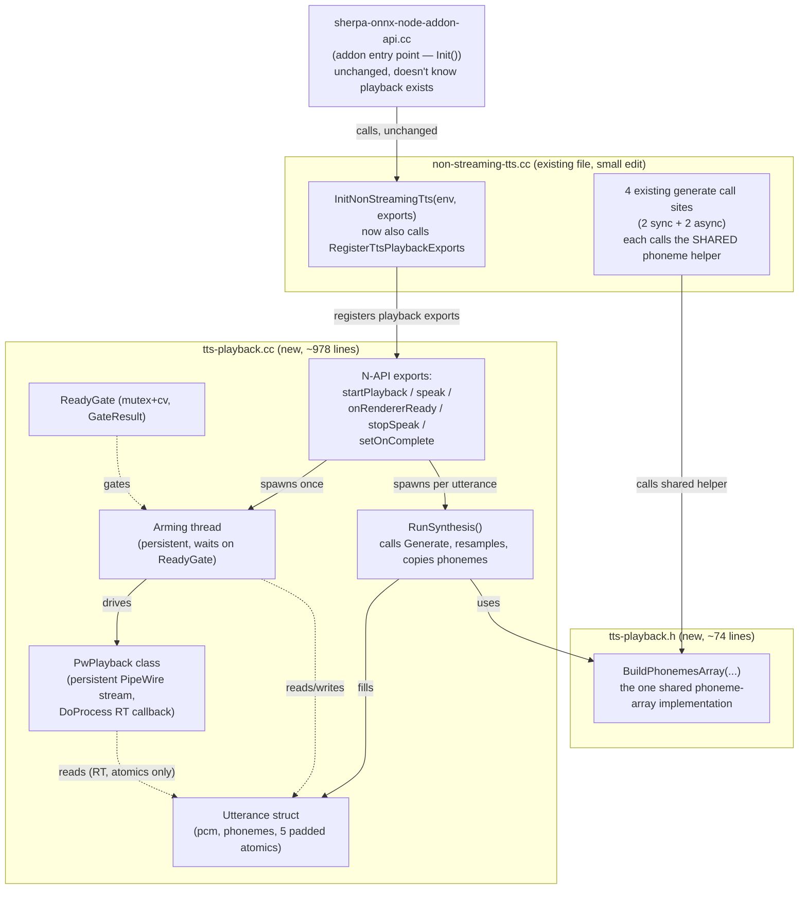
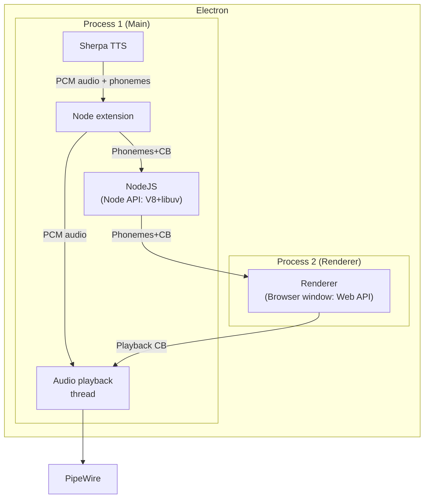

# <div align="center"> 🎙️ Sherpa‑ONNX TTS Phoneme Timing + Synced Playback Extension</div>

<div align="center">Model‑agnostic timed phoneme output <i>and</i> non‑blocking, lip‑sync‑synced PipeWire audio playback for Electron apps</div>

<div align="center">
         


</div>

---

## Overview

This extension adds two things on top of stock Sherpa‑ONNX offline TTS:

1. **Time‑aligned phoneme sequences** — every `generate()` call can return an array of phoneme objects with start/end timestamps, ready for driving facial animation.
2. **Non‑blocking, synchronized audio playback** — a `speak()` API that synthesizes audio, delivers phonemes to your renderer, and starts PipeWire playback at the exact moment your lip‑sync animation is primed — with the real‑time audio path kept completely lock‑free and PCM data never crossing into JavaScript.

**Opt‑in** – phoneme timing activates via `enableTimedPhonemes: true`; playback is a fully additive API (`startPlayback`/`speak`/etc.) that doesn't change any existing behavior.
**Model‑agnostic phoneme extraction** – works with all TTS backends (Kokoro, VITS, Matcha, Piper, Kitten, etc.) via a shared timing layer.
**Playback is scoped to this project's deployment** – Kokoro v0.19 (Piper‑based, single‑language) on a Jetson/PipeWire target. See [Playback: scope and assumptions](#playback-scope-and-assumptions).
**Non‑breaking** – default behaviour is unchanged when the phoneme flag is off, and none of the existing generate paths were modified in behavior.

---

## Architecture — phoneme extraction (unchanged from the original extension)

```
Text → Frontend::ConvertTextToTokenIds()         (existing)
         ↓
      Frontend::ConvertTextToPhonemeSpans()       (virtual, default empty)
         ↓
      OfflineTtsImpl::Generate() → Model Run → PCM audio
         ↓
      [if enabled] BuildTimedPhonemes()           (uniform token durations)
         ↓
      GeneratedAudio { samples, sampleRate, phonemes }
```

### Key Components

| Component | Role |
|-----------|------|
| `PhonemeSpan` | Maps a phoneme string to a range of token indices |
| `TimedPhoneme` | Final output: phoneme, id, start/end seconds |
| `BuildTimedPhonemes()` | Divides total audio length equally among tokens |
| `ConvertTextToPhonemeSpans()` | Virtual method on `OfflineTtsFrontend` |
| `GetFrontend()` | Pure virtual on `OfflineTtsImpl` |

---

## Architecture — synced playback (new)

```
JS: speak(ttsHandle, text, sid, speed, onPhonemes)
   │  validates args, rejects if an utterance is already in flight
   │  returns an utteranceId immediately (non‑blocking)
   ▼
Synthesis thread (spawned per speak() call)
   │  calls the same SherpaOnnxOfflineTtsGenerateWithConfig the
   │  existing sync/async paths use — no reimplementation
   │  resamples if the model rate differs from the negotiated PipeWire rate
   │  delivers phonemes to JS via onPhonemes(msg)
   ▼
[Electron IPC → Renderer primes its lip‑sync timeline → sends "ready"]
   ▼
onRendererReady(utteranceId)
   │  arms the ReadyGate's renderer‑ready flag
   ▼
Arming thread (persistent, one per addon lifetime)
   │  waits for BOTH audio‑ready and renderer‑ready (2s timeout, then
   │  force‑starts anyway so a stuck renderer never blocks audio forever)
   │  calls Play() → activates the PipeWire stream
   ▼
PipeWire's own real‑time thread — DoProcess()
   │  the ONLY thing that reads the PCM buffer: atomics + memcpy only,
   │  no locks, no allocation, no logging, no JS
   ▼
🔊 Speaker
```

### The three threads (and only these three)

| Thread | Lifetime | Touches PCM? | Touches JS? |
|---|---|---|---|
| Synthesis thread | Per `speak()` call | Writes once, hands off | Phonemes only, via a callback |
| Arming thread | Persistent, addon lifetime | Never — only `Play()`/`Pause()` | Completion callback only |
| PipeWire RT thread | Server/rtkit‑managed | Only thing that reads/copies PCM | Never |

No other thread is added. If something needs doing off the main/JS thread, it happens on one of these three.

### Key components

| Component | Role |
|-----------|------|
| `Utterance` | One synthesized clip's PCM + phonemes + synchronization atomics — written once by the synth thread, read‑only after |
| `ReadyGate` | Mutex + condition_variable rendezvous between "audio ready" and "renderer ready"; `WaitBoth()` reports precisely which side timed out |
| `PwPlayback` | Owns one PipeWire stream for the addon's entire lifetime — created once, activated/paused per utterance, never reconnected |
| `RunSynthesis()` | Free function — calls Generate, resamples if needed, copies phonemes, destroys Sherpa's C‑owned buffer immediately |
| Arming thread | Waits on `ReadyGate`, then `Play()`s, polls for completion, `Pause()`s |

---

## Files Modified / Added

### Phoneme extraction (original extension — unchanged in this pass)

| File | What Was Added / Changed |
|------|---------------------------|
| `offline-tts.h` | `PhonemeSpan`, `TimedPhoneme` structs; `GeneratedAudio::phonemes` field; `enable_timed_phonemes` config flag |
| `offline-tts.cc` | `BuildTimedPhonemes()` helper; injection of timed phonemes in all three `Generate()` overloads |
| `offline-tts-frontend.h` | Virtual `ConvertTextToPhonemeSpans()` (default empty) |
| `offline-tts-impl.h` | Pure virtual `GetFrontend()` |
| `offline-tts-vits-impl.h` | `GetFrontend()` override returning `frontend_.get()` |
| `offline-tts-kokoro-impl.h` | Same |
| `offline-tts-kitten-impl.h` | Same |
| `offline-tts-matcha-impl.h` | Same |
| `offline-tts-zipvoice-impl.h` | Same |
| `offline-tts-pocket-impl.h` | `GetFrontend()` returning `nullptr` |
| `offline-tts-supertonic-impl.h` | `GetFrontend()` returning `nullptr` |
| `c-api.h` | `SherpaOnnxTimedPhoneme` struct; `phonemes`/`num_phonemes` in `SherpaOnnxGeneratedAudio`; `enable_timed_phonemes` in config |
| `c-api.cc` | Flag copy, phoneme data copy (C++ → C), memory cleanup; fixed uninitialised fields in deprecated Zipvoice function |
| `cxx-api.h` | `TimedPhoneme` struct; `phonemes` in `GeneratedAudio`; `enable_timed_phonemes` in `OfflineTtsConfig` |
| `cxx-api.cc` | Flag pass‑through; phoneme extraction from C struct; phoneme move in `Generate2()` |
| `piper-phonemize-lexicon.h` / `.cc` | `ConvertTextToPhonemeSpans()` — captures espeak phonemes, maps them to `PhonemeSpan` objects for VITS, Matcha, Kokoro, Kitten |

### Playback (this pass — additive, on top of the above)

| File | Status | What's inside |
|------|--------|----------------|
| `scripts/node-addon-api/src/sherpa-onnx-node-addon-api.cc` | **Unchanged** | Addon entry point — doesn't need to know playback exists |
| `scripts/node-addon-api/src/non-streaming-tts.cc` | **Modified**, 3 small edits | +1 include, +1 line registering playback exports, its 4 existing phoneme‑array blocks now call the one shared helper instead of duplicating it |
| `scripts/node-addon-api/src/tts-playback.h` | **New** (~74 lines) | Shared phoneme‑array helper (`BuildPhonemesArray`) used by all 5 call sites; one exported declaration |
| `scripts/node-addon-api/src/tts-playback.cc` | **New** (~978 lines) | `Utterance`, `ReadyGate`, `PwPlayback`, `RunSynthesis`, the arming thread, and all five exported functions (`startPlayback`, `speak`, `onRendererReady`, `stopSpeak`, `setOnComplete`) |

No other files are touched. `non-streaming-tts.cc`'s existing synthesis calls, config parsing, and Promise/AsyncWorker plumbing are otherwise untouched — this pass only removed duplication, it didn't change behavior.

---

## Build

Standard Sherpa‑ONNX build, plus PipeWire for the playback feature:

```bash
mkdir build && cd build
cmake ..
make -j$(nproc)
```

The Node.js addon additionally requires `libpipewire-0.3-dev` (confirmed via `pkg-config --exists libpipewire-0.3`; the build fails with a clear error at compile time — not a runtime crash — if the installed version predates `PW_STREAM_FLAG_RT_PROCESS`, which has been present since PipeWire 0.3.0).

---

## Usage — phoneme extraction only (no playback)

### 1. Enable the feature

```js
const sherpa = require('sherpa-onnx-node');

const config = {
  model: { /* your model files (Kokoro, VITS, etc.) */ },
  enableTimedPhonemes: true,   // ← turn on phoneme timing
};

const tts = new sherpa.OfflineTts(config);
```

### 2. Generate audio and phonemes

```js
const result = tts.generate({ text: "Hello world", sid: 0, speed: 1.0 });

// result.samples    – Float32Array
// result.sampleRate – number
// result.phonemes   – Array of { phoneme, id, startMs, endMs }

console.log(result.phonemes);
// [
//   { phoneme: "h", id: 1, startMs: 0,   endMs: 60.5  },
//   { phoneme: "ə", id: 2, startMs: 60.5, endMs: 121.0 }
// ]
```

This path is unchanged — audio and phonemes come back together, synchronously or via a Promise, and you're responsible for playback and timing yourself (see the original manual‑timer example below if you want to drive lip‑sync without using the playback feature at all).

### Minimal standalone script — phonemes only, no playback

Save as `test-phonemes-only.js` and run with `node test-phonemes-only.js`:

```js
const sherpa = require('./scripts/node-addon-api/build/Release/sherpa-onnx.node');

const config = {
  model: {
    kokoro: {
      model:   '/path/to/kokoro-en-v0_19/model.onnx',
      voices:  '/path/to/kokoro-en-v0_19/voices.bin',
      tokens:  '/path/to/kokoro-en-v0_19/tokens.txt',
      dataDir: '/path/to/kokoro-en-v0_19/espeak-ng-data',
    },
    numThreads: 2,
  },
  enableTimedPhonemes: true,
};

const tts = sherpa.createOfflineTts(config);
console.log('Sample rate:', sherpa.getOfflineTtsSampleRate(tts));

const result = sherpa.offlineTtsGenerate(tts, { text: 'Hello world', sid: 0, speed: 1.0 });

console.log('Audio samples:', result.samples.length);
console.log('Phoneme count:', result.phonemes.length);
console.log(JSON.stringify(result.phonemes, null, 2));
```

Expected output shape (truncated):
```json
[
  { "phoneme": "h", "id": 1, "startMs": 60.5, "endMs": 121.0 },
  { "phoneme": "ə", "id": 2, "startMs": 121.0, "endMs": 181.4 }
]
```

<details>
<summary>Manual lip‑sync timer, without the playback feature (click to expand)</summary>

```js
// Play the audio yourself (Web Audio API, or a Node audio library)
const audioCtx = new AudioContext();
const source = audioCtx.createBufferSource();
source.buffer = float32ArrayToAudioBuffer(result.samples, result.sampleRate);
source.connect(audioCtx.destination);
source.start();

// Drive lip‑sync with your own timer
let idx = 0;
const startTime = audioCtx.currentTime;
const interval = setInterval(() => {
  const elapsed = (audioCtx.currentTime - startTime) * 1000; // ms
  while (idx < result.phonemes.length && elapsed >= result.phonemes[idx].endMs) idx++;
  if (idx < result.phonemes.length) {
    updateMouthShape(result.phonemes[idx].phoneme);
  } else {
    clearInterval(interval);
  }
}, 16); // ~60 fps
```

This works, but you own the playback engine, the timing loop, and any drift between the two yourself. The playback feature below exists to remove that burden.
</details>

---

## Usage — synced playback (new)

This is the recommended path if you want audio to play back through the system's PipeWire sink, synchronized with a renderer‑side lip‑sync animation, without writing your own playback/timing code.

### 1. Create the TTS handle and start playback (once, at startup)

```js
const { OfflineTts } = require('./scripts/node-addon-api/lib/non-streaming-tts.js');
const addon = require('./scripts/node-addon-api/lib/addon.js');

const tts = new OfflineTts({
  model: {
    kokoro: {
      model:   '/path/to/kokoro-en-v0_19/model.onnx',
      voices:  '/path/to/kokoro-en-v0_19/voices.bin',
      tokens:  '/path/to/kokoro-en-v0_19/tokens.txt',
      dataDir: '/path/to/kokoro-en-v0_19/espeak-ng-data',
    },
    numThreads: 2,
  },
  enableTimedPhonemes: true,   // required — playback relies on phoneme delivery too
});

// Starts the persistent PipeWire stream and the arming thread. Call once,
// right after the TTS handle exists. Idempotent — safe to call again, but
// only the first call does anything.
const started = addon.startPlayback(tts.handle);
if (!started) {
  console.error('startPlayback failed — check libpipewire-0.3 / PipeWire session');
}
```

### 2. Register the completion callback (once, before the first `speak()`)

```js
addon.setOnComplete((result) => {
  if (result.ok) {
    console.log(`Utterance ${result.utteranceId} finished playing.`);
  } else {
    console.error(`Utterance ${result.utteranceId} failed: ${result.error}`);
  }
  // This is your signal that it's safe to call speak() again —
  // only one utterance can be in flight at a time.
});
```

### 3. Speak — the callback you pass here receives phonemes as soon as they're ready

```js
function speakSomething(text) {
  let utteranceId;
  try {
    utteranceId = addon.speak(
      tts.handle,
      text,
      /* sid   = */ 0,
      /* speed = */ 1.0,
      // ← THIS is the phoneme callback. It fires once, asynchronously,
      //   from a background synthesis thread — NOT immediately when
      //   speak() returns. speak() itself returns the utteranceId right
      //   away, before synthesis has even started.
      (msg) => {
        // msg = { utteranceId, phonemes: [{phoneme, id, startMs, endMs}], sampleRate }
        console.log(`Got ${msg.phonemes.length} phonemes for utterance ${msg.utteranceId}`);

        // ---> Send these to your Electron renderer over IPC so it can
        //      prime its lip-sync animation:
        mainWindow.webContents.send('tts:phonemes', msg);

        // Playback will NOT start yet — it's gated on both this
        // synthesis step AND the renderer signaling ready (step 4).
      }
    );
  } catch (err) {
    // Thrown synchronously if an utterance is already in flight.
    console.error('speak() rejected:', err.message);
    return;
  }
  console.log('Speaking, utteranceId =', utteranceId);
}
```

### 4. Tell it when your renderer is ready — this is what actually starts audio

```js
// Wired to an IPC message from the renderer, once it's done priming its
// lip-sync timeline from the phonemes it received in step 3:
ipcMain.on('tts:renderer-ready', (_event, { utteranceId }) => {
  addon.onRendererReady(utteranceId);
  // Playback starts once BOTH this fires AND synthesis has finished —
  // whichever happens second is what actually triggers Play(). If the
  // renderer never calls this within 2 seconds, playback force-starts
  // anyway (you'll see it logged), so a stuck renderer can't block audio
  // forever.
});
```

### 5. Optional — cancel mid‑utterance

```js
function stopCurrentSpeech(utteranceId) {
  const stopped = addon.stopSpeak(utteranceId);
  console.log(stopped ? 'Cancelled' : 'Nothing to cancel (id mismatch, or already finished)');
}
```

### Full callback‑order summary

```
you call speak(handle, text, sid, speed, onPhonemes)
   → returns utteranceId immediately (synthesis hasn't started yet)

[some time later, on a background thread]
   → onPhonemes(msg) fires — msg.phonemes is ready, msg.utteranceId matches
   → you forward msg to your renderer (IPC)

[your renderer primes its lip-sync UI, then signals ready]
   → you call addon.onRendererReady(msg.utteranceId)

[once audio synthesis AND renderer-ready have both happened — order doesn't matter]
   → PipeWire playback starts automatically, no further JS call needed

[when playback finishes, or is cancelled via stopSpeak(), or fails]
   → the callback you gave setOnComplete(...) fires with { utteranceId, ok, error? }
   → this is your signal that speak() can be called again
```

### Minimal standalone script — phonemes + playback together

Save as `test-playback.js` and run with `node test-playback.js`. Uses `setTimeout` in place of a real renderer, so it runs with no Electron app at all:

```js
const path = require('path');
const { OfflineTts } = require('./scripts/node-addon-api/lib/non-streaming-tts.js');
const addon = require('./scripts/node-addon-api/lib/addon.js');

const tts = new OfflineTts({
  model: {
    kokoro: {
      model:   '/path/to/kokoro-en-v0_19/model.onnx',
      voices:  '/path/to/kokoro-en-v0_19/voices.bin',
      tokens:  '/path/to/kokoro-en-v0_19/tokens.txt',
      dataDir: '/path/to/kokoro-en-v0_19/espeak-ng-data',
    },
    numThreads: 2,
  },
  enableTimedPhonemes: true,
});

console.log('startPlayback:', addon.startPlayback(tts.handle));

addon.setOnComplete((result) => {
  console.log('COMPLETE:', JSON.stringify(result));
});

const utteranceId = addon.speak(tts.handle, 'Hello from the playback test.', 0, 1.0, (msg) => {
  console.log(`Phonemes ready for utterance ${msg.utteranceId}: ${msg.phonemes.length} entries`);
  console.log(JSON.stringify(msg.phonemes, null, 2));

  // Stand-in for "renderer finished priming its lip-sync animation".
  // In a real Electron app this is addon.onRendererReady(msg.utteranceId)
  // called from ipcMain once the renderer sends its own ready signal.
  setTimeout(() => addon.onRendererReady(msg.utteranceId), 150);
});

console.log('speak() returned utteranceId:', utteranceId);
```

Expected console output (abridged):
```
startPlayback: true
speak() returned utteranceId: 1
Phonemes ready for utterance 1: 41 entries
[ ... full phoneme array ... ]
COMPLETE: {"utteranceId":1,"ok":true}
```

---

## Architecture diagrams

### Full detailed — files, threads, and data flow



### Simplified — runtime processes and data flow


CB = Callback. This is the same shape regardless of how many C++ files the logic lives in — file layout is an implementation detail; this is what actually happens at runtime.

---

## Electron IPC contract (if wiring a renderer)

| Direction | Channel | Payload |
|---|---|---|
| Renderer → Main | `tts:speak` | `{ text, sid?, speed? }` |
| Main → Renderer | `tts:phonemes` | `{ utteranceId, phonemes: [...], sampleRate }` |
| Renderer → Main | `tts:renderer-ready` | `{ utteranceId }` |
| Main → Renderer | `tts:playback-complete` | `{ utteranceId }` |
| Main → Renderer | `tts:error` | `{ utteranceId, error }` |

---

## Output Format

```ts
interface TimedPhoneme {
  phoneme: string;   // IPA symbol for Piper-based frontends, e.g. "h", "ə"
  id: number;        // 1-based sequential ID
  startMs: number;   // Start time in milliseconds
  endMs: number;     // End time in milliseconds
}

interface PhonemeDeliveryMessage {
  utteranceId: number;
  phonemes: TimedPhoneme[];
  sampleRate: number;
}

interface CompletionResult {
  utteranceId: number;
  ok: boolean;
  error?: string;   // present only when ok === false
}
```

Timestamps are derived from **uniform token durations** — each token gets an equal share of the total audio length. This gives rhythm‑correct lip‑sync adequate for most avatar systems, but is not model‑derived precise timing.

---

## Playback: scope and assumptions

The playback feature (`startPlayback`/`speak`/`onRendererReady`/`stopSpeak`/`setOnComplete`) was built for a specific deployment and makes some choices accordingly:

- **One TTS model, one deployment target.** Assumes Kokoro v0.19 (Piper‑based, single‑language). No branching on model type exists in the playback path.
- **One utterance in flight at a time.** A second `speak()` call while one is synthesizing/gated/playing is rejected synchronously — there's no internal queue.
- **Everything lives in as few files as this project needs.** The playback machinery (`tts-playback.h`/`.cc`) shares its phoneme‑array‑building code directly with `non-streaming-tts.cc` rather than duplicating it, since this is a single‑project codebase with one maintainer — there's no reason to keep them artificially separate.
- **Offline TTS only.** No streaming/incremental synthesis support.

---

## Limitations

- Timestamps are approximate (uniform token durations); true model‑specific durations are not implemented.
- Only Piper‑based frontends (Kokoro v0.19, Kitten, Piper) produce phoneme spans. Kokoro v1.0+ (multi‑lang) and some VITS variants would require additional implementation to extract phonemes.
- Models without a frontend (Pocket, Supertonic) always return an empty phoneme array.
- The playback feature has been verified on a development machine; **it has not yet been run on the target Jetson hardware**, and end‑to‑end latency (renderer‑ready → first audible sample) has not been measured with real numbers.
- No audio device hotplug/reconnect handling — a mid‑session USB audio disconnect is logged as a stream error, not recovered from.
- No long‑duration (multi‑hour) soak testing has been performed.

---

## Future Improvements

- Model‑specific duration extraction (override `GetTokenDurations()`)
- Full support for Kokoro v1.0+ `KokoroMultiLangLexicon`
- Optional forced‑alignment fallback for higher precision
- Streaming TTS support once the core engine adds it
- A small internal queue for `speak()` calls, if barge‑in/queueing is ever needed beyond the current single‑utterance‑at‑a‑time model
- Real Jetson hardware verification + measured end‑to‑end latency numbers

---

**Phoneme extraction is self‑contained and does not affect existing behaviour when the flag is off. Playback is fully additive — nothing about the existing `generate()` API changed.**
